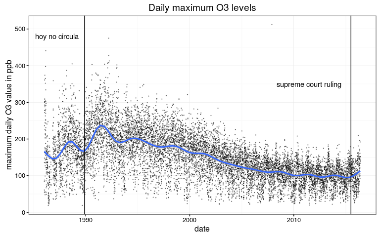

Mexico City Pollution Data
================
Diego Valle-Jones
March 18, 2016

-   [What does it do?](#what-does-it-do)
-   [Installation](#installation)
-   [Quick Example](#quick-example)

Master: [](https://travis-ci.org/diegovalle/aire.zmvm)

<table style="width:43%;">
<colgroup>
<col width="20%" />
<col width="22%" />
</colgroup>
<tbody>
<tr class="odd">
<td align="left"><strong>Author:</strong></td>
<td align="left">Diego Valle-Jones</td>
</tr>
<tr class="even">
<td align="left"><strong>License:</strong></td>
<td align="left"><a href="https://opensource.org/licenses/BSD-3-Clause">BSD_3</a></td>
</tr>
<tr class="odd">
<td align="left"><strong>Status:</strong></td>
<td align="left">alpha</td>
</tr>
<tr class="even">
<td align="left"><strong>Website:</strong></td>
<td align="left"><a href="https://github.com/diegovalle/aire.zmvm" class="uri">https://github.com/diegovalle/aire.zmvm</a></td>
</tr>
</tbody>
</table>

What does it do?
----------------

This package downloads pollution data for the Mexico City metro area. It can download real-time, daily maximum, minimum, or average for each of the pollution measuring stations or geographical zones in the Zona Metropolitana del Valle de México (greater Mexico City)

Installation
------------

For the moment this package is only available from github. For the development version:

``` r
if (!require(devtools)) {
    install.packages("devtools")
}
devtools::install_github('diegovalle/aire.zmvm')
```

Quick Example
-------------

The package consists mainly of three functions:

-   `get_station_data` to download data for each of the pollution (and wind and temperature) measuring stations.
-   `get_zone_data` to download data for each of the 5 geographic zones of Mexico City
-   `get_latest_data` to download the latest values for each of the pollution measuring stations.

``` r
library("aire.zmvm")
library("dplyr")
library("ggplot2")

o3 <- get_station_data(criterion = "MAXIMOS", # Can be one of MAXIMOS (daily maximum), 
                                                # MINIMOS (daily minimum), 
                                                # or HORARIOS (hourly average)
                       pollutant = "O3", # Can be one of "SO2", "CO", "NOX", "NO2", "NO", "O3", 
                                         # "PM10", "PM25", "WSP", "WDR", "TMP", "RH"
                       year = 2015:2016) # A numeric vector, the earliest year allowed is 1986
knitr::kable(head(o3))
```

| date       | station\_code | pollutant | unit |  value|
|:-----------|:--------------|:----------|:-----|------:|
| 2015-01-01 | ACO           | O3        | ppb  |     54|
| 2015-01-01 | AJM           | O3        | ppb  |     83|
| 2015-01-01 | AJU           | O3        | ppb  |     42|
| 2015-01-01 | ATI           | O3        | ppb  |     98|
| 2015-01-01 | CAM           | O3        | ppb  |     75|
| 2015-01-01 | CCA           | O3        | ppb  |     75|

``` r
# Daily max among all base stations
o3_max <- o3 %>% 
  group_by(date) %>% 
  summarise(max = ifelse(all(is.na(value)),
                         NA,
                         base::max(value, na.rm = TRUE))) %>%
  na.omit()

# Plot the daily highest pm10 level with trendline
ggplot(o3_max, 
       aes(date, max, group = 1)) +
  geom_point(color = "black", size = .2, alpha = .4) +
  geom_smooth(method = "gam", formula = y ~ s(x, k = 25)) +
  ggtitle("Daily maximum O3 levels") +
  ylab("maximum daily O3 value in ppb") +
  xlab("date") +
  geom_vline(xintercept = as.numeric(as.Date("1989-11-20"))) +
  geom_vline(xintercept = as.numeric(as.Date("2015-07-01"))) +
  annotate("text", label = "hoy no circula", 
           x = as.Date("1987-03-20"),
           y = 480) +
  annotate("text", label = "supreme court ruling", 
           x = as.Date("2011-06-20"),
           y = 350) +
  theme_bw()
```

<!-- -->
